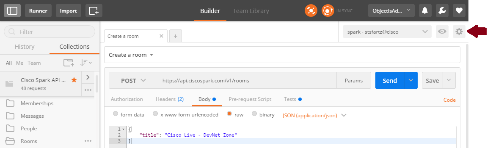

# Step by step guide to create a Postman environment

Postman lets you define environment variables to easilly abstract your execution context.

To create a new environment, click on the  icon in the upper right corner, and select "Manage environments".

In the "Manage environments" dialog, add the "spark_token" variable, and paste your Spark personal access token (without the Bearer prefix).
Note that you can retrieve this token from the [Spark for developers](https://developer.ciscospark.com) portal, by clicking on your avatar, or by copy pasting from the resources documentation when in test mode.

