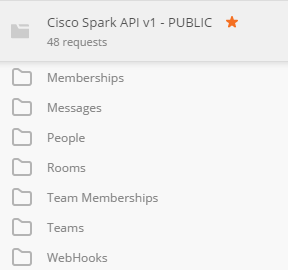

# Postman collections for Cisco Spark

This repo regroups Postman collection for the Cisco Spark API v1, as documented on [Spark for Developers](https://developer.ciscospark.com/quick-reference.html).

## scripted-collection

Introduced at Cisco Live Vegas in July 2016, the collection was made available then through [bit.ly](bit.ly/POSTMAN-SPARK-API).
It is now maintained in this repository.

The collection illustrates the full set of Spark API resources, with direct link to the official API documentation.

The collection is scripted so that you can run in a row all REST call for a resource.
Concretely, the identifier of any resource created is retreived automatically and injected into the next REST query.
Moreover, all newly created Spark resources are freed at the end of each resource scenario.

## Contributing

To share collections enhancements or some of your  own postman collections that proved to be handy over time, you're very welcome to submit a pull request. Thank you! 
