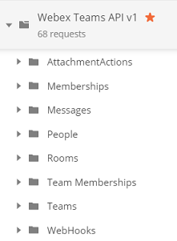
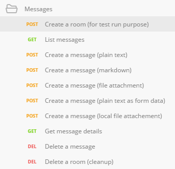
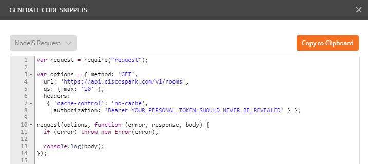
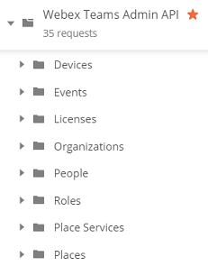

# Postman collections for Cisco Spark

This repo gathers Postman collections for the [Cisco Spark API](https://developer.ciscospark.com/quick-reference.html):
- [public REST API](#all-resources-scripted): Rooms, Messages, Teams, People, Webhooks... everything accessible from an API token without admin priviledges
- [admin API](#admin-api): Organizations, People creation and updates, Roles, Licenses, these admin related features that require a token with admin priviledges
- [direct room use case](#direct-room): Create a 1-1 room by sending a direct message

If you're new to Postman, you're only a few steps away from gettinh the full benefits of the collections:
1. [import and configure](docs/ImportAndConfigure.md) a collection 
2. [generate code](docs/GenerateCode.md) for your favorite language
3. [optional] note that the postman suite lets you [run collections as part of your CI/CD process](https://www.getpostman.com/docs/newman_intro) via the newman command, and can also help you [publish documentation via documenter](https://www.getpostman.com/docs/creating_documentation).

**We welcome pull requests for enhancements of existing collections, as well as contributions of collections that proved to be handy for you. 
When submitting a new collection, please ensure it leverages a {{spark_token}} variable to ease environments sharing among collections. Thank you!** 

## [all-resources-scripted](https://raw.githubusercontent.com/CiscoDevNet/postman-ciscospark/master/all-resources-scripted.json)

Introduced at Cisco Live Vegas in July 2016, this collection was originally made available through [bit.ly](https://bit.ly/POSTMAN-SPARK-API).
It is now maintained in this repository.

The collection illustrates the REST API Public Resources, with direct links to the official Cisco Spark API documentation.

Worth mentionning that the collection is scripted so that you can run REST calls in a row for any given resource:
- as you run REST queries from top to bottom, newly created resource identifiers are automatically retreived and injected into your postman environment as temporary variable,
- so that the next REST query will look from the postman environment, and execute in the context of the previous query. For example, you'll add a message into the room you just created in the previous step. 
- at the end of each scenario, we've added one or several requests to free newly created Spark resources so that you'll end up in the same state as before running the set of queries.

Enough talk, let's practice:
- [import the all-resources-scripted collection](docs/ImportAndConfigure.md), 
- create or select a postman environment that contains a {{spark_token}} variable, 
- now, you're ready to invoke the Spark API,
- for example, go to the Messages folder, and run the requests from top to bottom.

Now, what about generating some code for your favorite language ?

Take the [Generate Code Guide](docs/GenerateCode.md) and have this nodejs code snippet automatically generated for the Spark API Resource "List Rooms":

## [admin-api](https://raw.githubusercontent.com/CiscoDevNet/postman-ciscospark/master/admin-scripted.json)

The collection illustrates the REST API **Administration Resources**, with direct link to the [Admin API documentation](https://developer.ciscospark.com/admin-api.html).

Note that the collection is also rendered in HTML for [quick browsing via Postman Documenter](https://documenter.getpostman.com/view/30210/cisco-spark-admin-api-public/2PMC7h).

## [direct-room](https://raw.githubusercontent.com/CiscoDevNet/postman-ciscospark/master/direct-room.json)

Illustrates how to create a 1-1 room by sending a direct message to a Cisco Spark Account 's email address.

Also illustrates the fact that it is not possible to DELETE nor LEAVE 1-1 rooms via the API (as of October 2016)

