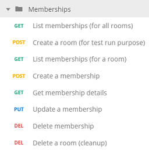
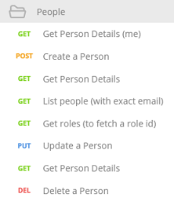

# Postman collections for Webex Teams

This repo gathers collections for the **[Webex Teams](https://developer.webex.com/quick-reference.html)**.
_Check the [postman-xapi repo](https://github.com/CiscoDevNet/postman-xapi) if looking for collections for **Webex Devices**._

- **[Webex Teams API v1](#all-resources-scripted)**: Messages, Spaces, Teams, People, Webhooks, AttachmentActions... all Webex Teams resources accessible from an access token, with no admin priviledges
- [Webex Admin API v1](#admin-api): Organizations, People creation and updates, Roles, Licenses, and Events. These admin related features are accessible only with an access token with admin priviledges

If you're new to Postman, you're only a few steps away from getting the full benefits of the collections:
1. [import and configure](docs/ImportAndConfigure.md) a collection 
2. [generate code](docs/GenerateCode.md) for your favorite language
3. [run collections as part of your CI/CD process](https://www.getpostman.com/docs/newman_intro) via the newman command
4. [publish documentation via documenter](https://www.getpostman.com/docs/creating_documentation).

**We welcome pull requests for enhancements of existing collections, as well as contributions of collections that proved to be handy for you. 
When submitting a new collection, please ensure it leverages a {{access_token}} variable to ease environments sharing among collections. Thank you!** 

## [all-resources-scripted](https://raw.githubusercontent.com/CiscoDevNet/postman-webex/master/all-resources-scripted.json)

The collection implements the public(*) resources for the Webex Teams REST API , with direct links to the official API documentation. _(*) use a simple user account, no need admin priviledges_

Worth mentionning that the collection is scripted so that you can run REST calls in a row for any given resource:
- as you run REST queries from top to bottom, newly created resource identifiers are automatically retreived and injected into your postman environment as temporary variables,
- so that the next REST query will look from the postman environment, and execute in the context of the previous query. For example, you'll add a message into the space you just created in the previous step. 
- at the end of each scenario (embedded in individual collection folders), we've added requests to free newly created resources so that you'll end up in the same state as before running the queries in postman.

Enough talk, let's practice:
- [import the all-resources-scripted collection](docs/ImportAndConfigure.md), 
- create or select a postman environment that contains a {{access_token}} variable, 
- now, you're ready to invoke the API: for example, go to the Messages folder, and run the requests from top to bottom.

Now, what about generating some code for your favorite language ?

Take the [Generate Code Guide](docs/GenerateCode.md) and have this Node.js code snippet automatically generated for the API Resource "List spaces":

Note that the collection is also rendered in HTML for [quick browsing via Postman Documenter](https://documenter.getpostman.com/view/30210/71CYsEp).

## [admin-api](https://raw.githubusercontent.com/CiscoDevNet/postman-webex/master/admin-scripted.json)

The collection illustrates the REST API **Administration Resources**, with direct link to the [Admin API documentation](https://developer.webex.com/admin-api.html).

Note that the collection is also rendered in HTML for [quick browsing via Postman Documenter](https://documenter.getpostman.com/view/30210/2PMC7h).

The People folder is populated with pre-request and post-request scripts in order to ease the creation of random accounts.

 

