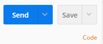
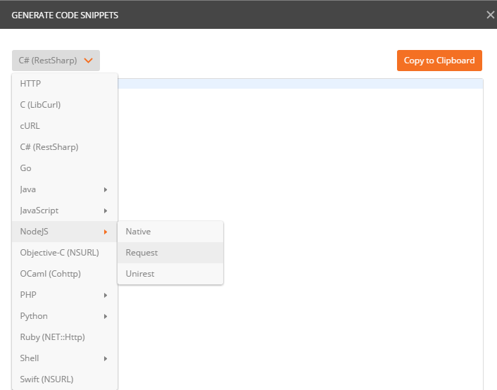
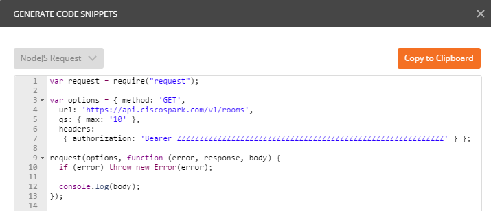

# Code generation with Postman

Postman lets you [generate code](https://www.getpostman.com/docs/code_snippets) in up to 15 languages.

Simply select a REST request in your collection, and click on the **Code** link, right under the Save button.

As the code generation popup opens, pick your favorite language from the combo.

Check the code generated by postman.

As an example:
- import the "all-resources-scripted" collection,
- expand the Rooms resource folder,
- select the List Rooms request,
- click the Code link

Here is the code you'll get if you ask postman to generate a nodejs/request code snippet:

Note that if you look at it carefully, you'll notice the extra header "postman-token". 
This header you need to remove manually as you'll copy paste into your application code. 

