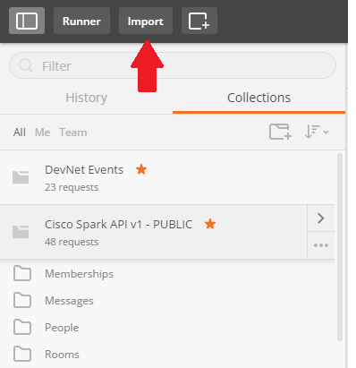
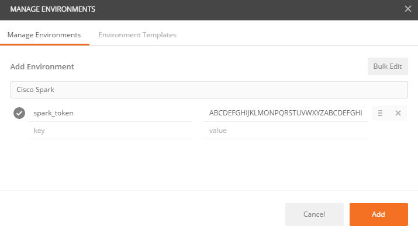

# Import and configure a collection

## Not a Postman user yet ?

The tool comes with a free basic plan.

[Download](https://www.getpostman.com/) as a Chrome or Desktop application.

## How to import a collection into postman

Click on the import button on the top left corner 

Select "Import from link" and specify the URL of the collection to import.
For example, paste the [link to the all-resources-scripted collection](https://raw.githubusercontent.com/CiscoDevNet/postman-webex/master/all-resources-scripted.json).

To pick any collection listed in this repo:
- go to the collection you want to import, 
- click raw
- paste the link from your browser URL 

## Configure your execution environement

Postman lets you define [environment variables](https://www.getpostman.com/docs/environments) to easilly abstract your execution contexts.

This is where we'll specify the token used to access the Webex Teams REST API.

> Tip: 
> create [several environments to switch](https://www.getpostman.com/docs/test_multi_environments) from one Webex account to another.
> As for instance, to jump back and forth from your personal account to one or several of your bot accounts.

To create a new environment, click on the  icon in the upper right corner, and select "Manage environments".

In the "Manage environments" dialog, add the `{{access_token}}` variable, and paste your personal access token, or a Bot access token - **without the Bearer prefix**.

Note that you can retrieve your personal access token from the [Webex for Developers Getting Started](https://developer.webex.com/getting-started.html#authentication) page.

